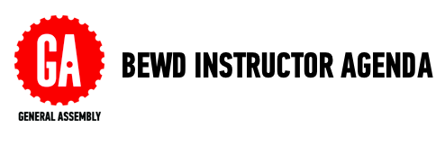

##Lesson 3 - Collections & Iteration 

###Learning Objectives

*	Define arrays, hashes and differentiate between the two.
*	Describe iteration in computational thinking and relate to loops.
*	Apply loops to manipulate collections  (arrays and hashes). 

###Schedule

| Time        | Topic| Materials| Comments |
| ------------- |:-------------|:-------------------|:-------------------|
| 20 min | Review| lesson 2 material|Review student questions before moving on to new content.| 
| 25 min | Iteration | | No code along here. Students will use what is on the slides and ruby docs to complete the iteration exercise.|
| 50 min | Arrays|code demo | |
| 25 min | Hashes | code demo | Focus is on understanding the logic behind hashes. Less on syntax|
| 60 min | Lab Time|| Includes working with arrays and hashes. |

###Homework

-	Continue work on Secret Number. Due next class (lesson 4)

